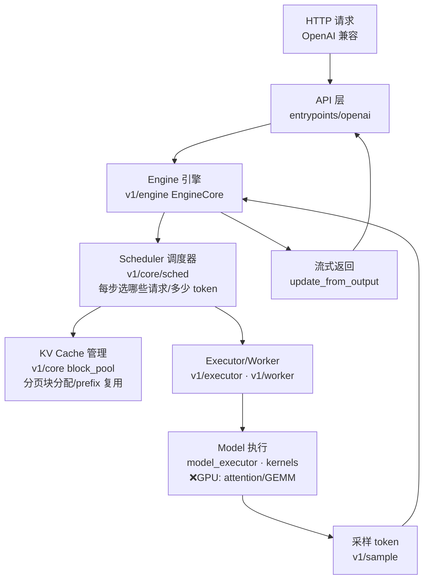

# 01 · 架构分类与学习计划（分门别类）

> 自顶向下第二层：把 vLLM 拆成子系统，看清一个请求怎么流过整个系统，
> 再据"我的强项 + 无 GPU"排出学习优先级。**这一层是钻细节前的地图。**

## 1. 一个请求的生命周期（数据流）

一句话：**API 收请求 → Engine 主循环 → Scheduler 决定这步跑什么 → KV 管理分配显存块 → Worker 在 GPU 上前向 → 采样出 token → 更新状态 → 流式吐回。** 循环直到生成结束。

## 2. 子系统分类表（含 GPU 依赖 + 我的优先级）

| 子系统 | 目录 | 职责 | 需 GPU? | 我的优先级 |
|---|---|---|---|---|
| **API/服务层** | `entrypoints/openai` | HTTP、OpenAI 协议、鉴权、流式 | ❌ | ⭐⭐ 主场 |
| **Engine 引擎** | `v1/engine`, `engine` | 主循环，串起调度+执行 | ❌ | ⭐⭐ 主场 |
| **Scheduler 调度** | `v1/core/sched` | continuous batching、抢占、准入 | ❌ | ⭐⭐⭐ 最强项 |
| **KV Cache 管理** | `v1/core`(block_pool, kv_cache_manager) | PagedAttention 分页块、prefix caching | ❌ | ⭐⭐⭐ 强项 |
| **分布式协调** | `distributed`, `v1/executor` | TP/PP/DP/EP、多 worker 通信 | 半 | ⭐⭐ 感兴趣 |
| **多租户 LoRA** | `lora` | 多 LoRA 隔离/切换 | 半 | ⭐ 关联多租户经验 |
| **可观测** | `tracing`, `v1/metrics` | OTel、指标、Prometheus | ❌ | ⭐ 关联 OTel 背景 |
| **配置** | `config` | 参数体系、校验 | ❌ | ✅ 易上手/易改文档 |
| **结构化输出** | `v1/structured_output` | JSON/grammar 约束解码 | ❌ | ✅ 逻辑层 |
| **投机解码** | `v1/spec_decode` | n-gram/EAGLE 草稿 token | 半 | ✅ 逻辑层 |
| Model 执行 | `model_executor`, `models` | 模型前向、权重加载 | ✅ | ❌ 暂避 |
| Attention/GEMM kernel | `kernels`, `csrc`, `attention` | CUDA/HIP 算子 | ✅ | ❌ 暂避 |
| 量化 | `model_executor/layers/quant` | FP8/INT4/GPTQ... | ✅ | ❌ 暂避 |

## 3. 三个"新旧架构"要知道的点
- vLLM 正在从旧的 `engine/` 迁到新架构 **`v1/`**（更清晰的调度/执行分离）。读代码优先看 `v1/`。
- `v1/core/` 是**无 GPU 逻辑核心**：调度 + KV 管理都在这，最适合我。
- `csrc/`、`kernels/`、`rust/` 是编译层，本地无 GPU 装机用 `VLLM_USE_PRECOMPILED=1` 跳过。

## 4. 学习计划（分阶段，自顶向下）

- **阶段 0 · 总览** ✅ → [00-project-overview.md](00-project-overview.md)（是什么/痛点/效果）
- **阶段 1 · 架构地图** ✅ → 本文（子系统分类 + 数据流）
- **阶段 2 · 逐个精读我的强项子系统**（按数据流顺序）：
  - [ ] 02 · Scheduler 调度器 → [02-scheduler.md](02-scheduler.md)（已初稿，待回看校对）
  - [ ] 03 · KV Cache 分页块管理（block_pool + kv_cache_manager）
  - [ ] 04 · Engine 主循环（EngineCore 如何串起来）
  - [ ] 05 · API/服务层（api_server 请求处理）
- **阶段 3 · 定位并动手第一个 PR**：
  - [ ] 浏览 GitHub `good first issue` / `documentation` 标签
  - [ ] 结合已读子系统挑 1 个能上手的（文档/小逻辑+单测）
  - [ ] 从干净 `main` 切分支，`git commit -s`，提 PR

> 原则：**先理解整体再钻细节**；每读一个子系统，先问"它在数据流里的位置和职责"，再看实现。

---
_研读日期：2026-07-02_
