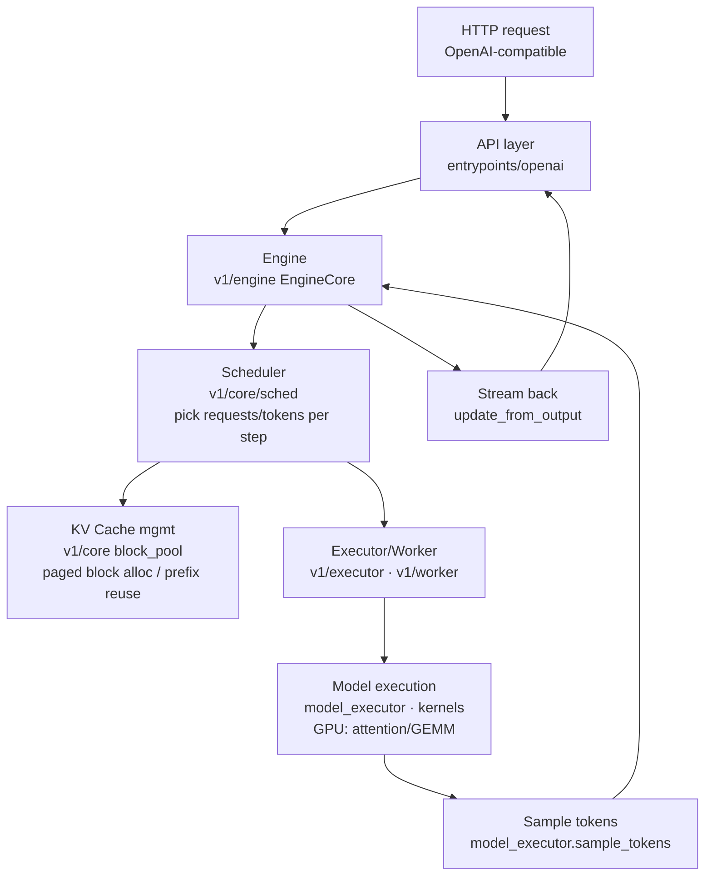

# 01 · Architecture Map and Study Plan (classification)

> Top-down layer 2: break vLLM into subsystems, see how a request flows through the whole system,
> then order study priority by "my strengths + no GPU". **This layer is the map before diving into detail.**
> Correction: top-down **must be grounded in real source code**, not only md/online material. Section 1.5 is the skeleton read from the source.

## 1. Lifecycle of a request (data flow)



In one line: **API receives request -> Engine main loop -> Scheduler decides what runs this step -> KV mgmt allocates memory blocks -> Worker runs the forward pass on GPU -> sample tokens -> update state -> stream back.** Loop until generation completes.
> Note: `sample_tokens()` is an **executor** method (`vllm/v1/executor/abstract.py`); it is drawn as a separate box only for data-flow clarity, not a separate subsystem.

## 1.5 Source-verified skeleton (read from source, with file:line)

> Not guessed — every step below is matched in the source. This is the core output of "top-down + read source".

**Outer driver loop** `EngineCoreProc.run_busy_loop()` — `vllm/v1/engine/core.py:1259`
```python
while not shutdown:
    self._process_input_queue()   # take client requests from input_queue -> scheduler.add_request() (into the waiting queue)
    self._process_engine_step()   # call self.step_fn() = EngineCore.step(); push outputs into output_queue
```

**One step** `EngineCore.step()` — `vllm/v1/engine/core.py:479`
```python
scheduler_output = self.scheduler.schedule(...)                    # 1 schedule: which requests / how many tokens this step
future = self.model_executor.execute_model(scheduler_output, ...)  # 2 execute: GPU forward (I do not touch this layer)
model_output = future.result() or self.model_executor.sample_tokens(...)  # 3 sample tokens
engine_core_outputs = self.scheduler.update_from_output(...)       # 4 update request state / check stop / emit results
```

**Key architecture facts** (interview talking points):
- **Process decoupling**: the Engine runs in its own process/thread; the API layer talks to it via `input_queue` / `output_queue` (ZMQ/mp). Request ingress/egress and engine stepping are asynchronous.
- **The essence of continuous batching**: the busy loop keeps calling `step()`, and each step `schedule()` **re-decides** the running set — new requests join at any time, finished ones leave, prefill and decode are mixed in the same GPU forward pass. Unlike the traditional "static batch that waits until full to depart". This is one core reason it is 24x faster than HF (the other half is PagedAttention saving memory to fit a larger batch).
- **Scheduling vs execution separation**: the `Scheduler` (pure CPU logic, my sweet spot) only produces a `SchedulerOutput` (who runs, how many tokens each, which KV blocks); `model_executor` is what touches the GPU. **This boundary is exactly the line between what I can contribute and what needs a GPU.**

Call chain at a glance:
```
Client(API/AsyncLLM) --input_queue--> EngineCoreProc.run_busy_loop
    |- _process_input_queue -> scheduler.add_request()   [request into the waiting queue]
    |- _process_engine_step -> EngineCore.step()
           |- scheduler.schedule()            [vllm/v1/core/sched/scheduler.py:393]  my sweet spot
           |- model_executor.execute_model()  [GPU forward]                          needs GPU
           |- model_executor.sample_tokens()  [sampling]                             needs GPU
           |- scheduler.update_from_output()  [update state / emit tokens]           my sweet spot
    |- outputs -> output_queue --> Client -> detokenize -> stream HTTP response
```

> Omitted from this skeleton for clarity (all real, seen inside `step()`): mid-step abort drain (`_process_aborts_queue`), grammar bitmask fetch for structured output (`get_grammar_bitmask`), and speculative-decode draft-token update in `post_step` (`take_draft_token_ids`).

## 2. Subsystem table (with GPU dependency + my priority)

| Subsystem | Directory | Responsibility | GPU? | My priority |
|---|---|---|---|---|
| **API / serving layer** | `entrypoints/openai` | HTTP, OpenAI protocol, auth, streaming | No | High (sweet spot) |
| **Engine** | `v1/engine`, `engine` | Main loop, wires scheduling + execution | No | High (sweet spot) |
| **Scheduler** | `v1/core/sched` | continuous batching, preemption, admission | No | Highest (strongest) |
| **KV cache mgmt** | `v1/core` (block_pool, kv_cache_manager) | PagedAttention paged blocks, prefix caching | No | High (strength) |
| **Distributed coordination** | `distributed`, `v1/executor` | TP/PP/DP/EP, multi-worker comms | Partial | Medium (interested) |
| **Multi-tenant LoRA** | `lora` | multi-LoRA isolation/switching | Partial | Low (relates to multi-tenant exp) |
| **Observability** | `tracing`, `v1/metrics` | OTel, metrics, Prometheus | No | Low (relates to OTel background) |
| **Config** | `config` | parameter system, validation | No | Yes (easy start / doc-friendly) |
| **Structured output** | `v1/structured_output` | JSON/grammar constrained decoding | No | Yes (logic layer) |
| **Speculative decoding** | `v1/spec_decode` | n-gram/EAGLE draft tokens | Partial | Yes (logic layer) |
| Model execution | `model_executor`, `models` | model forward, weight loading | Yes | Avoid for now |
| Attention/GEMM kernels | `kernels`, `csrc`, `attention` | CUDA/HIP operators | Yes | Avoid for now |
| Quantization | `model_executor/layers/quant` | FP8/INT4/GPTQ... | Yes | Avoid for now |

> Out of scope (specialized, not on the core serving/scheduling path): `vllm/multimodal` (image/audio/video inputs), `vllm/reasoning` (reasoning-token parsers), `vllm/tokenizers` (per-model tokenization), `vllm/plugins` (I/O processors, LoRA resolvers). Multimodal is the largest and can pull in GPU encoders when used.

## 3. Three "new vs old architecture" things to know
- vLLM is migrating from the old `engine/` to the new **`v1/`** architecture (cleaner scheduling/execution separation). Prefer reading `v1/`. (`vllm/engine/llm_engine.py` is now just a thin alias: `LLMEngine = V1LLMEngine`.)
- `v1/core/` is the **no-GPU logic core**: scheduling + KV management live here — best fit for me.
- `csrc/`, `kernels/`, `rust/` are the compiled layer; on a local no-GPU machine, use `VLLM_USE_PRECOMPILED=1` to skip building.

## 4. Study plan (staged, top-down)

- **Stage 0 · Overview** Done -> [00-project-overview.md](00-project-overview.md) (what/pain/effect)
- **Stage 1 · Architecture map** Done -> this note (subsystem classification + data flow)
- **Stage 2 · Read strength subsystems in detail** (in data-flow order):
  - [ ] 02 · Scheduler -> [02-scheduler.md](02-scheduler.md) (draft done, review pending)
  - [ ] 03 · KV cache paged block management (block_pool + kv_cache_manager)
  - [ ] 04 · Engine main loop (how EngineCore wires it together)
  - [ ] 05 · API / serving layer (api_server request handling)
- **Stage 3 · Locate and make a first PR**:
  - [ ] Browse GitHub `good first issue` / `documentation` labels
  - [ ] Pick one workable item related to the subsystems read (docs / small logic + unit test)
  - [ ] Branch from clean `main`, `git commit -s`, open a PR

> Principle: **understand the whole before diving into detail**; for each subsystem, first ask "its position and responsibility in the data flow", then read the implementation.

---
_Study date: 2026-07-02_
