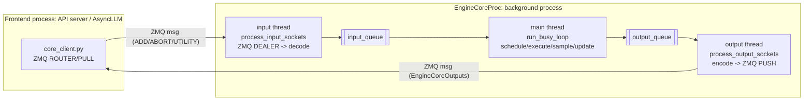

# 04 · Engine Skeleton Deep-Dive (Stage 2 detail)

> Prereq: [00-project-overview.md](00-project-overview.md), [01-architecture-map.md](01-architecture-map.md).
> Files: `vllm/v1/engine/core.py` (EngineCore, EngineCoreProc), `core_client.py`, `async_llm.py`, `llm_engine.py`.
> This note answers: "what exactly is the system skeleton, and how does a request physically flow through it?"

## 0. The big picture: 3 layers, 1 background process, 3 threads



Key idea: in the default serving mode (`VLLM_ENABLE_V1_MULTIPROCESSING`), the **engine runs in its own OS process**, spawned via `multiprocessing` (`EngineCoreProc.run_engine_core` is the `Process` target — see `vllm/v1/engine/utils.py`), isolated from the API/HTTP process; the two processes communicate over **ZMQ + msgpack**. *Inside* that engine process, work is split across **three threads** (input, main busy-loop, output) that talk via thread-safe `queue.Queue` objects (`input_queue`/`output_queue`), so socket IO and (de)serialization overlap with the GPU forward on the main thread (threads release the GIL during socket IO). (A simpler in-process mode also exists for basic offline `LLM` use.)

## 1. `EngineCore` — the composition root (`core.py:96`)

`EngineCore.__init__` wires the whole inner engine together:
- `self.model_executor = executor_class(vllm_config)` — the executor (GPU layer: runs the model, samples). **The only GPU-touching part.**
- `self._initialize_kv_caches(...)` — profiles free GPU memory, decides `num_gpu_blocks` for the KV cache.
- `self.scheduler = Scheduler(...)` — the CPU-side scheduler (see [02-scheduler.md](02-scheduler.md)).
- `self.structured_output_manager` — grammar/JSON constrained decoding.
- `self.request_block_hasher` — hashes prompt blocks for prefix caching (only if prefix caching / KV connector enabled).
- `self.batch_queue` — a `deque` of size `max_concurrent_batches`; enabled (>1) for pipeline parallelism.
- `self.step_fn = self.step if batch_queue is None else self.step_with_batch_queue` — picks the stepping strategy.

So the engine is: **executor (GPU) + scheduler (CPU) + KV config + a step function**. Everything else wraps this.

## 2. `EngineCore.step()` — one synchronous iteration (`core.py:479`)

```python
def step(self):
    if not self.scheduler.has_requests():
        return {}, False
    scheduler_output = self.scheduler.schedule(...)                    # 1 decide what runs
    future = self.model_executor.execute_model(scheduler_output, non_block=True)  # 2 GPU forward (async)
    grammar_output = self.scheduler.get_grammar_bitmask(scheduler_output)
    model_output = future.result() or self.model_executor.sample_tokens(grammar_output)  # 3 sample
    self._process_aborts_queue()
    engine_core_outputs = self.scheduler.update_from_output(scheduler_output, model_output)  # 4 update
    return engine_core_outputs, scheduler_output.total_num_scheduled_tokens > 0
```
Four steps: **schedule -> execute -> sample -> update**. This is the minimal loop body.

## 3. `EngineCore.step_with_batch_queue()` — the pipelined variant (`core.py:519`)

Used when `max_concurrent_batches > 1` (pipeline parallelism). The goal is to **eliminate pipeline
bubbles** by keeping several batches in flight:
1. If the batch queue is not full, **schedule a new batch and execute it non-blocking**, push its
   `future` into `batch_queue`, then **return immediately** (filling the pipeline has higher priority
   than collecting outputs).
2. Only when the queue is full (or no more requests) do we **block on the oldest batch's `future.result()`**.
3. Then `update_from_output()` as usual.
- Trade-off note in code: handling deferred sampling favors TTFT vs TPOT/throughput.

So `step()` = simple 1-in-flight; `step_with_batch_queue()` = N-in-flight pipeline. Same 4 logical stages.

## 4. `run_busy_loop()` — the driver (`core.py:1259`)

```python
def run_busy_loop(self):
    while self._handle_shutdown():
        self._process_input_queue()   # drain input_queue -> add_request / abort / utility
        self._process_engine_step()   # call step_fn(); push outputs to output_queue
```
- `_process_input_queue()` (`core.py:1269`): blocks until there is work; drains all pending client
  requests via `_handle_client_request()`.
- `_process_engine_step()` (`core.py:1300`): calls `self.step_fn()`, puts each output into `output_queue`,
  runs `post_step()` (draft-token update for spec decode). If no model ran but requests remain (e.g.
  waiting for remote KV), sleeps 1ms to yield the GIL to transfer threads.

## 5. The client<->engine message protocol (`_handle_client_request`, `core.py:1372`)

Requests are typed (`EngineCoreRequestType`):
| Type | Action |
|---|---|
| `ADD` | `add_request(req)` -> scheduler waiting queue |
| `ABORT` | `abort_requests(ids)` -> finish as aborted (added to both aborts_queue + input_queue for eager+ordered handling) |
| `UTILITY` | RPC-style call of an engine method (reset cache, get stats...), result -> output_queue |
| `WAKEUP` | no-op; just wakes the idle loop |
| `EXECUTOR_FAILED` | raise, tears down the engine |

This is effectively a small RPC protocol between frontend and engine over ZMQ.

## 6. The two IO threads (the physical request path)
> `input_queue`/`output_queue` here are thread-safe `queue.Queue` objects *inside* the engine process; the only cross-process hop is ZMQ.

### Input thread `process_input_sockets` (`core.py:1484`)
- ZMQ **DEALER** sockets connect to the frontend's ROUTER.
- On startup, sends a **handshake** `EngineCoreReadyResponse` (max_model_len, num_gpu_blocks, block_size,
  dtype, world_size, dp_size...) so the frontend learns engine capacity before sending work.
- Poll loop: `recv_multipart` -> first frame = request type, rest = data -> `MsgpackDecoder.decode` ->
  for `ADD`, run `preprocess_add_request` -> `input_queue.put_nowait((type, request))`.
- Aborts are pushed to **both** `aborts_queue` (eager) and `input_queue` (ordered); abort is idempotent.

### Output thread `process_output_sockets` (`core.py:1589`)
- ZMQ **PUSH** sockets to the frontend (which uses **PULL**); the input side is engine **DEALER** ↔ frontend **ROUTER**.
- Loop: `output_queue.get()` -> `MsgpackEncoder.encode_into(buffer)` -> `send_multipart(copy=False, track=True)`.
- **Zero-copy** sends with a **buffer-reuse pool** + `MessageTracker` (reclaim buffers once ZMQ is done),
  important because outputs may carry tensors/np arrays.
- `ENGINE_CORE_DEAD` sentinel signals shutdown to the frontend.

## 7. Why this design (interview talking points)
- **Process isolation**: engine crash/GPU OOM does not take down the HTTP server; clean lifecycle via
  handshake + `ENGINE_CORE_DEAD`.
- **Thread split for overlap**: socket IO + (de)serialization run on separate threads that release the
  GIL, overlapping with the GPU forward on the main thread -> higher throughput.
- **Queue decoupling**: `input_queue`/`output_queue` turn the whole thing into a classic
  producer-consumer; the busy loop never blocks on the network.
- **Pipelining** (`step_with_batch_queue`): keep N batches in flight to remove PP bubbles.
- **Zero-copy + buffer reuse**: minimize serialization overhead on the hot output path.
- **Data parallelism**: multiple `EngineCoreProc` instances (engine_index) coordinated by a DP coordinator.

## 8. Not just single-node: the executor layer and the two planes

A common misconception: "vLLM is just single-machine multi-process/thread with queue decoupling." That is
only the **simplest deployment** and only the **control plane**. The executor layer (`vllm/v1/executor/`)
shows vLLM is a **distributed** inference system that scales from 1 GPU to multi-node clusters:

| Executor | Shape | Use case |
|---|---|---|
| `UniProcExecutor` | single process | single GPU (simplest) |
| `MultiprocExecutor` | multiple `WorkerProc` processes | **single-node multi-GPU** |
| `RayDistributedExecutor` / `RayExecutorV2` | Ray cluster | **multi-node multi-GPU** |

**Two planes** (critical distinction):
- **Control / request plane = queues, async, loosely coupled** (this is the "queue decoupling" picture):
  - frontend <-> engine: ZMQ; engine main <-> IO: in-process `input_queue`/`output_queue`;
  - engine -> workers: a shared-memory message queue broadcasts commands (`SchedulerOutput`) to each GPU worker.
- **Data / compute plane = NCCL collectives, synchronous, tightly coupled** (NOT queues):
  - When multiple GPUs compute **one model** (Tensor Parallel), **every layer** does `all-reduce`/`all-gather`
    to sync intermediate tensors. This is inherently synchronous — you cannot decouple a collective with a queue.

```
Control plane (queues/async)        Data plane (NCCL/sync)
frontend --ZMQ--> engine            GPU0  \
                   | broadcast       GPU1  |- all-reduce per layer (TP)
                   v (shmem MQ)      GPU2  |
              worker0 worker1 ...    GPU3  /
```

The four parallelism dimensions all live on the data plane: **TP** (split one model across GPUs),
**PP** (split layers across GPUs/nodes), **DP** (full replicas + coordinator), **EP** (MoE experts).
So: vLLM's control/request plane is queue-decoupled multi-process/thread (and that is all there is on a
single node), but its **compute plane** — many GPUs computing one model — is NCCL-tightly-coupled, which is
the real core of "distributed inference".

## 9. Links to my experience
- ZMQ DEALER/ROUTER + PUSH/PULL + typed messages ~= the **RPC/message-bus** systems I built.
- input/output threads + queues overlapping IO with compute ~= **producer-consumer + backpressure** design.
- Handshake advertising capacity (num_gpu_blocks) ~= **capacity negotiation / admission**.
- Process isolation + DEAD sentinel ~= **fault isolation / graceful degradation** I did in reliability work.
- Control plane (queues) vs data plane (NCCL collectives) ~= the **control/data plane split** in the distributed systems I know.

## 10. Open threads / next
- [ ] `core_client.py`: the frontend side (how AsyncLLM sends ADD and reads outputs).
- [ ] `async_llm.py` / `output_processor.py`: detokenization + streaming back to HTTP.
- [ ] DP coordinator: how multiple engine procs load-balance (relates to distributed coordination).

---
_Study date: 2026-07-02_
